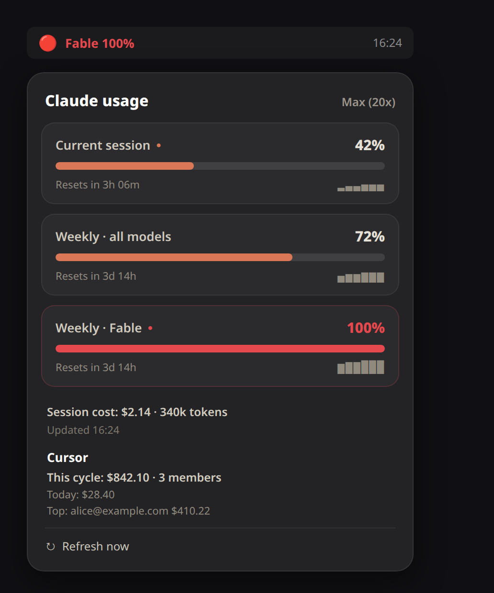

# Claude Usage Panel

A GNOME Shell extension that shows your **Claude Code plan usage** in the top bar — the same numbers you see in `/usage`, but always visible.

Unlike other Claude usage extensions, it reads the official endpoint's modern `limits[]` array, so it shows **every** limit including **per-model weekly limits** (e.g. Fable), not just the aggregate session/weekly pair.



> **macOS?** A native SwiftUI menu-bar version lives in [`macos/`](macos/) — same data layer, same designed dropdown. See [macos/README.md](macos/README.md).

## Features

- **All plan limits** in one designed dropdown: current session, weekly (all models), and per-model weekly limits (Fable, Opus, …).
- **Severity colors** — normal / warning / **critical**, driven by the API's own `severity` field.
- **Reset timers** — `Resets in 3h 06m`, `Resets in 4d 2h`.
- **Compact top-bar readout** — shows the worst limit (or the current session, your choice), e.g. `Fable 100%`.
- **Optional session cost** — the official API does not expose dollar cost on subscription plans, so cost is computed locally via [`ccusage`](https://github.com/ryoppippi/ccusage) when enabled.
- **Configurable refresh** — defaults to every 10 minutes.
- **Read-only & private** — reads your existing `~/.claude/.credentials.json` token, never writes it, and talks only to `api.anthropic.com`.

## How it works

The extension reads the OAuth access token that Claude Code already stores in
`~/.claude/.credentials.json` and calls the official usage endpoint:

```
GET https://api.anthropic.com/api/oauth/usage
    authorization: Bearer <token>
    anthropic-beta: oauth-2025-04-20
```

The response contains a `limits[]` array — one entry per active limit, each with
a `percent`, a `severity`, a `resets_at`, and an optional model `scope`. The
extension renders one card per limit. If the token expires, it prompts you to
run any Claude Code command (which refreshes it) — it never touches the file.

## Install

### From source

```bash
git clone https://github.com/fschmutz/claude-usage-panel.git
cd claude-usage-panel
./install.sh
```

Then **log out and back in** (required on Wayland to load a new extension), and enable it:

```bash
gnome-extensions enable claude-usage-panel@fschmutz.github.io
```

### Requirements

- GNOME Shell 45–50
- An active Claude Code login (`~/.claude/.credentials.json` present)
- Optional, for cost: Node.js / `npx` (or a global `ccusage`)

## Settings

Open via the dropdown's **Settings** entry, or:

```bash
gnome-extensions prefs claude-usage-panel@fschmutz.github.io
```

- **Refresh interval** — minutes between polls (default 10).
- **Top bar shows** — worst limit or current session.
- **Show session cost** — enable local `ccusage` cost computation.

## Privacy

This extension is read-only with respect to your credentials and makes exactly
one outbound request per refresh, to Anthropic's official API, with your own
token. No telemetry, no third parties. When cost is enabled it additionally runs
`ccusage` locally against your `~/.claude/projects/*.jsonl` logs.

## License

MIT — see [LICENSE](LICENSE).
